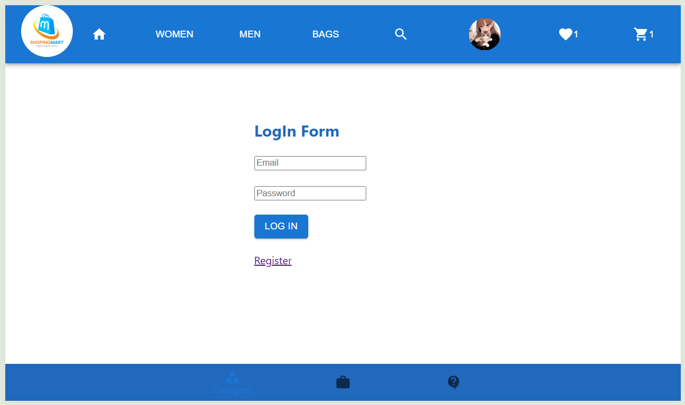
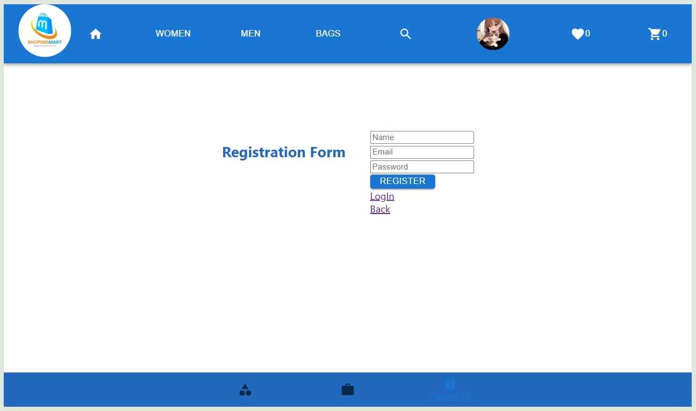
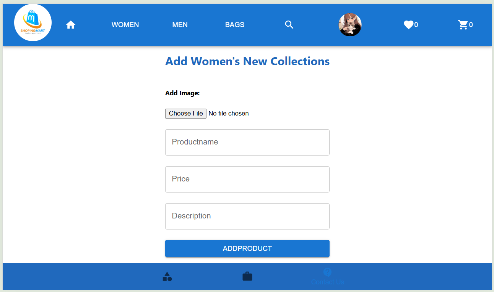
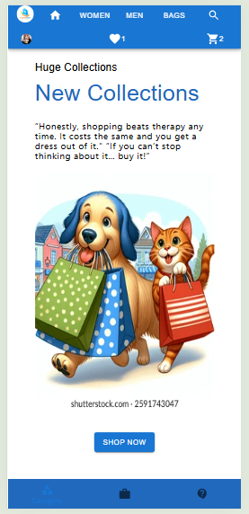

# 🛍️ shopping-mart

This is a Shopping Mart Web Application built with React JS and Material-UI (MUI).
The project uses a Redux Store for state management, and all application data like authentication, cart, and favorites are handled directly inside the store.

# 📌 Features

🔐 Authentication

Login, Register, and Logout pages.

User authentication state managed via Redux Store.

👩‍💻 Admin Panel

Admin can add products into categories.

Categories include: Women, Men, Bags.

🛒 Shopping Features

Product listing by categories.

Add to Cart, view cart, remove from cart.

Favorites page to mark liked products.

# 👤 Profile Page

User profile and account management.

📂 Folder Structure

shopping-mart/
│── src/
│   ├── components/          # Reusable UI components (Buttons, Cards, Headers, Footers)
│   ├── pages/               # Pages like Login, Register, Catalog, Cart, Profile, Favorites
│   ├── redux/               # Redux Store setup, slices (cartSlice, userSlice, viewSlice)
│   ├── App.js               # Main app entry
│   └── index.js             # Providers to give the main path.
│
├── package.json
└── README.md

# To run the app, follow the steps below after cloning or downloading:

Install dependencies: npm install

Start the React App (UI): npm start

# 🛠️ Tech Stack

Frontend: React JS, Material-UI (MUI)

State Management: Redux Toolkit (Store)

# Images
**Basic Details:-**

**Login page:**

**Register Page:**

**Adding products to catlog page from admin user:**

**Mobile View:**

